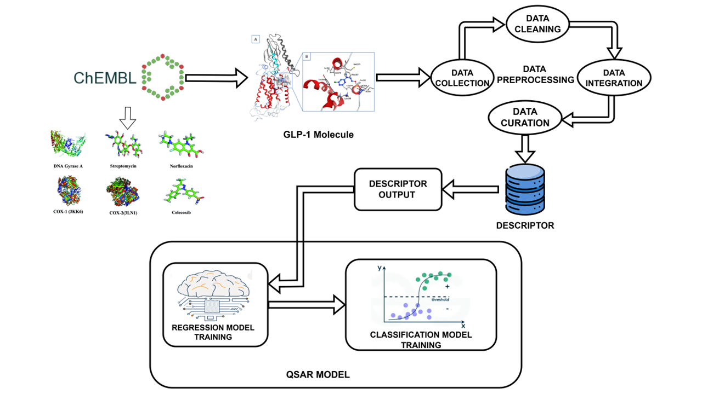

<div align="center">

# 💊 QSAR-Based Drug Discovery for GLP-1 Receptor Agonists

### A Machine Learning-Based QSAR Study for Predicting GLP-1 Receptor Bioactivity Using Molecular Descriptors, Molecular Fingerprints, and Advanced Predictive Modeling

<p align="center">


</p>

### 🧬 Predicting GLP-1 Receptor Bioactivity Using Artificial Intelligence, Molecular Informatics, and QSAR Modeling

</div>

---

## 📖 About the Project

Drug discovery is a lengthy, expensive, and resource-intensive process that often requires years of laboratory experimentation before a potential drug reaches clinical trials. Computational drug discovery techniques such as **Quantitative Structure–Activity Relationship (QSAR) modeling** have become powerful tools for accelerating the early stages of pharmaceutical research by predicting the biological activity of chemical compounds from their molecular structures.

This project presents an **end-to-end QSAR pipeline** for predicting the bioactivity of **GLP-1 (Glucagon-Like Peptide-1) receptor agonists**, an important therapeutic target for the treatment of **Type 2 Diabetes Mellitus** and **Obesity**.

The study utilizes experimentally validated bioactivity data obtained from the **ChEMBL Database**, followed by molecular descriptor generation, fingerprint extraction, feature engineering, and machine learning-based regression and classification modeling to identify compounds with promising biological activity.

The workflow integrates **RDKit**, **PaDEL-Descriptor**, **Lipinski's Rule of Five**, and multiple machine learning algorithms to demonstrate how artificial intelligence can support modern computational drug discovery and virtual screening.

---

## 🌟 Project Highlights

- 💊 End-to-end QSAR-based drug discovery pipeline
- 🧬 GLP-1 receptor agonist bioactivity prediction
- 📊 ChEMBL bioactivity dataset analysis
- ⚗️ Molecular descriptor generation using RDKit and PaDEL
- 🧪 Lipinski Rule of Five analysis
- 🧬 Analysis of 12 molecular fingerprint representations
- 🤖 Regression and Classification QSAR models
- 📈 Performance comparison of multiple machine learning algorithms
- 🎯 Best Classification Accuracy: **92.8%**
- 📊 Best AUC Score: **0.908 (SVM)**
- 📈 Best Regression Performance: **R² = 0.88 (Random Forest)**
- 🧠 Practical application of AI in computational drug discovery

---

# 🏗️ Project Workflow

<div align="center">



*Figure 1. End-to-end workflow of the QSAR-based drug discovery pipeline for predicting GLP-1 receptor bioactivity using molecular descriptors, molecular fingerprints, and machine learning models.*

</div>

The workflow begins with collecting experimentally validated bioactivity data from the **ChEMBL database**. The dataset undergoes preprocessing, cleaning, integration, and curation before generating molecular descriptors and fingerprints using **RDKit**, **PaDEL-Descriptor**, and **Lipinski's Rule of Five**. Feature engineering techniques are then applied to prepare the data for machine learning. Finally, regression and classification models are trained and evaluated to predict the bioactivity of GLP-1 receptor agonists.

---

# 🎯 Objectives

This project was developed with the following objectives:

- Collect experimentally validated GLP-1 receptor bioactivity data from the ChEMBL database.
- Perform comprehensive data preprocessing and cleaning.
- Generate molecular descriptors using RDKit and PaDEL-Descriptor.
- Evaluate compounds using Lipinski's Rule of Five.
- Generate and compare twelve molecular fingerprint representations.
- Perform feature engineering and descriptor selection.
- Build regression models to predict pIC50 values.
- Build classification models to predict active and inactive compounds.
- Compare multiple machine learning algorithms.
- Evaluate models using standard regression and classification metrics.
- Demonstrate the application of Artificial Intelligence in computational drug discovery.

---

# ✨ Project Features

## 🧪 Drug Discovery Pipeline

- End-to-end QSAR workflow
- Molecular descriptor generation
- Molecular fingerprint extraction
- Bioactivity prediction
- Virtual screening pipeline

## 📊 Data Analysis

- Exploratory Data Analysis (EDA)
- Bioactivity distribution analysis
- Descriptor correlation analysis
- Statistical feature analysis

## 🧬 Molecular Informatics

- RDKit descriptors
- PaDEL descriptors
- Lipinski descriptors
- Molecular fingerprints
- Structural feature extraction

## 🤖 Machine Learning

- Regression modeling
- Classification modeling
- Feature engineering
- Model comparison
- Performance evaluation

## 📈 Visualization

- Correlation heatmaps
- Feature importance plots
- Regression prediction plots
- ROC Curve analysis
- Descriptor distribution analysis

---

# 📂 Dataset Information

| Property | Description |
|-----------|-------------|
| **Dataset Source** | ChEMBL Database |
| **Target Protein** | GLP-1 Receptor |
| **Therapeutic Area** | Type 2 Diabetes & Obesity |
| **Total Compounds** | 207 |
| **Data Type** | Bioactivity Dataset |
| **Modeling Tasks** | Regression & Classification |
| **Descriptor Tools** | RDKit, PaDEL-Descriptor |
| **Fingerprint Types** | 12 Molecular Fingerprints |
| **Programming Language** | Python |
| **Dataset Format** | CSV |

---

## 📊 Dataset Statistics

| Metric | Value |
|---------|------:|
| Total Compounds | 207 |
| Regression Models | 3 |
| Classification Models | 3 |
| Molecular Fingerprints | 12 |
| Descriptor Sources | RDKit, PaDEL & Lipinski |
| Machine Learning Algorithms | 6 |
| Bioactivity Target | GLP-1 Receptor |

---

# 🧬 Molecular Descriptors & Molecular Fingerprints

Molecular descriptors and fingerprints provide a numerical representation of chemical structures, enabling machine learning algorithms to identify relationships between molecular properties and biological activity.

This project combines **RDKit**, **PaDEL-Descriptor**, and **Lipinski's Rule of Five** to generate informative molecular features for QSAR modeling.

---

## 🧪 RDKit Molecular Descriptors

RDKit was used to calculate physicochemical properties of each molecule.

| Descriptor | Description |
|------------|-------------|
| Molecular Weight (MW) | Total molecular mass |
| LogP | Lipophilicity of the compound |
| TPSA | Topological Polar Surface Area |
| Heavy Atom Count | Number of non-hydrogen atoms |
| Aromatic Ring Count | Number of aromatic rings |
| Rotatable Bonds | Molecular flexibility |
| Hydrogen Bond Donors | Hydrogen donor atoms |
| Hydrogen Bond Acceptors | Hydrogen acceptor atoms |

---

## ⚗️ Lipinski Rule of Five

Lipinski's Rule of Five was applied to evaluate the drug-likeness of the compounds.

The following molecular properties were analyzed:

- Molecular Weight
- LogP
- Hydrogen Bond Donors
- Hydrogen Bond Acceptors

These descriptors help determine whether a compound is likely to possess favorable oral bioavailability.

---

## 🧬 PaDEL Molecular Descriptors

PaDEL-Descriptor was used to generate a comprehensive set of molecular descriptors, including:

- 1D Molecular Descriptors
- 2D Molecular Descriptors
- Constitutional Descriptors
- Topological Descriptors
- Electronic Descriptors
- Hybrid Descriptors

These descriptors provide additional structural information beyond standard physicochemical properties.

---

# 🔬 Molecular Fingerprints

To capture structural similarities between molecules, twelve molecular fingerprint representations were generated and analyzed.

The fingerprint representations include:

- Morgan Fingerprints
- MACCS Keys
- Atom Pair Fingerprints
- Topological Fingerprints
- Circular Fingerprints
- Additional structural fingerprint representations generated using PaDEL

These fingerprints encode molecular substructures into binary feature vectors suitable for machine learning applications.

---

# 🏛️ System Architecture

```text
                ChEMBL Database
                       │
                       ▼
          GLP-1 Bioactivity Dataset
                       │
                       ▼
              Data Collection
                       │
                       ▼
      Data Cleaning & Preprocessing
                       │
                       ▼
      Data Integration & Curation
                       │
                       ▼
     Descriptor Generation (RDKit)
                       │
                       ▼
     PaDEL Descriptor Generation
                       │
                       ▼
      Molecular Fingerprints
                       │
                       ▼
         Feature Engineering
                       │
          ┌────────────┴────────────┐
          ▼                         ▼
 Regression Models         Classification Models
          │                         │
          └────────────┬────────────┘
                       ▼
             Model Performance
                       │
                       ▼
       GLP-1 Bioactivity Prediction
```
---

# 🤖 Machine Learning Models

To predict the bioactivity of GLP-1 receptor agonists, both **Regression** and **Classification** machine learning models were developed and evaluated. Multiple algorithms were compared to identify the most accurate and reliable predictive model.

---

# 📈 Regression Models

Regression models were trained to predict the continuous **pIC50 bioactivity values** of GLP-1 receptor agonists.

| Model | Description |
|--------|-------------|
| 🌲 Random Forest Regressor | Ensemble learning using multiple decision trees |
| 📈 Support Vector Regressor (SVR) | Kernel-based non-linear regression |
| 🚀 Gradient Boosting Regressor | Sequential boosting regression algorithm |

### Regression Workflow

```
Molecular Descriptors
          │
          ▼
Feature Engineering
          │
          ▼
Regression Models
          │
          ▼
Predicted pIC50 Values
```

---

# 🎯 Classification Models

Classification models were developed to classify compounds into **Active** and **Inactive** classes based on their biological activity.

| Model | Description |
|--------|-------------|
| 🌲 Random Forest Classifier | Ensemble decision tree classifier |
| 🎯 Support Vector Machine (SVM) | Maximum-margin binary classifier |
| ⚡ XGBoost Classifier | Gradient boosting classifier |

### Classification Workflow

```
Molecular Fingerprints
          │
          ▼
Feature Engineering
          │
          ▼
Classification Models
          │
          ▼
Active / Inactive Prediction
```

---

# 📊 Model Performance

## 📈 Regression Model Comparison

| Model | R² Score | MSE | RMSE |
|---------|---------:|---------:|---------:|
| 🌲 Random Forest Regressor | **0.88** | **0.44** | **0.66** |
| 📈 Support Vector Regressor | 0.87 | 0.49 | 0.70 |
| 🚀 Gradient Boosting Regressor | 0.85 | 0.56 | 0.75 |

### 🏆 Best Regression Model

✅ **Random Forest Regressor**

**Why it performed best**

- Captures complex non-linear relationships
- Robust against overfitting
- Handles high-dimensional descriptor data effectively
- Provides stable predictions across molecular descriptors

---

## 🎯 Classification Model Comparison

| Model | Accuracy | ROC-AUC |
|---------|---------:|---------:|
| 🌲 Random Forest Classifier | **92.8%** | 0.827 |
| 🎯 Support Vector Machine | **92.8%** | **0.908** |
| ⚡ XGBoost Classifier | **92.8%** | 0.891 |

### 🏆 Best Classification Model

✅ **Support Vector Machine (SVM)**

**Why it performed best**

- Excellent separation of active and inactive compounds
- Superior generalization capability
- Robust with high-dimensional molecular fingerprints
- Achieved the highest ROC-AUC score

---

# 📉 Model Evaluation Metrics

## Regression Metrics

| Metric | Description |
|----------|-------------|
| R² Score | Measures goodness of fit |
| Mean Squared Error (MSE) | Average squared prediction error |
| Root Mean Squared Error (RMSE) | Standard deviation of prediction errors |

---

## Classification Metrics

| Metric | Description |
|----------|-------------|
| Accuracy | Percentage of correctly classified compounds |
| Precision | Correct positive predictions |
| Recall | Ability to identify active compounds |
| F1 Score | Harmonic mean of Precision and Recall |
| ROC-AUC Score | Overall classification performance |

---

# 🏅 Model Comparison Summary

| Task | Best Model | Performance |
|--------|------------|------------|
| Regression | 🌲 Random Forest Regressor | **R² = 0.88** |
| Classification | 🎯 Support Vector Machine | **Accuracy = 92.8%** |
| Best ROC Performance | 🎯 Support Vector Machine | **AUC = 0.908** |

---

# 📌 Key Results

- ✅ Developed a complete QSAR pipeline for GLP-1 receptor bioactivity prediction.
- ✅ Successfully processed **207 bioactive compounds** obtained from the ChEMBL database.
- ✅ Generated molecular descriptors using **RDKit**, **PaDEL-Descriptor**, and **Lipinski analysis**.
- ✅ Extracted and analyzed **12 molecular fingerprint representations**.
- ✅ Built both **Regression** and **Classification** machine learning models.
- ✅ Achieved **92.8% Classification Accuracy**.
- ✅ Achieved **0.908 ROC-AUC Score** using the **Support Vector Machine** classifier.
- ✅ Achieved an **R² Score of 0.88** using the **Random Forest Regressor**.
- ✅ Demonstrated the effectiveness of QSAR modeling for early-stage computational drug discovery.

---

# 💡 Research Significance

Traditional drug discovery often requires years of laboratory experiments and significant financial investment. This project demonstrates how machine learning and QSAR modeling can accelerate the early stages of drug discovery by computationally predicting compound bioactivity before experimental validation.

The developed pipeline can assist researchers in:

- Prioritizing promising compounds
- Reducing experimental screening costs
- Accelerating lead identification
- Supporting virtual screening studies
- Assisting medicinal chemistry research

---

# 🛠️ Technology Stack

## Programming & Development

| Technology | Purpose |
|------------|---------|
| 🐍 Python | Core Programming Language |
| 📓 Jupyter Notebook | Interactive Development Environment |
| 🐼 Pandas | Data Processing & Analysis |
| 🔢 NumPy | Numerical Computing |

---

## Chemoinformatics

| Tool | Purpose |
|------|---------|
| 🧬 RDKit | Molecular Descriptor Calculation |
| ⚗️ PaDEL-Descriptor | Descriptor & Fingerprint Generation |
| 💊 Lipinski Analysis | Drug-Likeness Evaluation |
| 🧪 ChEMBL Database | Bioactivity Data Source |

---

## Machine Learning

| Library | Purpose |
|----------|---------|
| Scikit-learn | Regression & Classification Models |
| XGBoost | Gradient Boosting Classification |

---

## Data Visualization

| Library | Purpose |
|----------|---------|
| Matplotlib | Scientific Visualization |
| Seaborn | Statistical Visualization |

---

# 📁 Project Structure

```text
QSAR_BASED_DRUG_DISCOVERY/
│
├── Models/
│   ├── 1_Data_Preprocessing.ipynb
│   ├── 2_RDKit_Descriptors.ipynb
│   ├── 3_PaDEL_Descriptors.ipynb
│   ├── 4_Regression_Models.ipynb
│   └── 5_Classification_Models.ipynb
│
├── Figures/
│   ├── workflow.png
│
├── requirements.txt
│
├── README.md
│
└── LICENSE
```

---

# ⚙️ Installation

## Clone the Repository

```bash
git clone https://github.com/JnanaranjanMajhi/QSAR_BASED_DRUG_DISCOVERY.git
```

```bash
cd QSAR_BASED_DRUG_DISCOVERY
```

---

## Install Dependencies

```bash
pip install -r requirements.txt
```

---

## Launch Jupyter Notebook

```bash
jupyter notebook
```

---

# 🚀 Usage

1. Download or prepare the GLP-1 receptor bioactivity dataset from ChEMBL.
2. Run the preprocessing notebook.
3. Generate molecular descriptors using RDKit.
4. Generate molecular fingerprints using PaDEL-Descriptor.
5. Perform feature engineering and descriptor selection.
6. Train regression models.
7. Train classification models.
8. Evaluate model performance.
9. Compare results and identify the best predictive model.

---

# 📷 Results & Visualizations

The repository includes visualizations generated during model development and evaluation.

### Available Visualizations

- 📊 Descriptor Distribution
- 📈 Regression Prediction Plot
- 📉 ROC Curve
- 🔥 Correlation Heatmap
- ⭐ Feature Importance
- 📋 Model Comparison Charts

> **Note:** Save your generated figures inside the `Figures/` directory to display them automatically in the README.

---

# 🎯 Applications

This project demonstrates the application of Artificial Intelligence in pharmaceutical research and computational chemistry.

Potential applications include:

- 💊 Drug Discovery
- 🧬 QSAR Modeling
- 🔬 Bioactivity Prediction
- ⚗️ Virtual Screening
- 🏥 Pharmaceutical Research
- 🧪 Medicinal Chemistry
- 🧠 AI in Healthcare
- 📊 Computational Drug Design

---

# 🎓 Skills Demonstrated

### Machine Learning

- Regression Modeling
- Classification Modeling
- Model Evaluation
- Performance Comparison

### Data Science

- Data Cleaning
- Exploratory Data Analysis
- Feature Engineering
- Statistical Analysis

### Chemoinformatics

- QSAR Modeling
- Molecular Descriptors
- Molecular Fingerprints
- Drug-Likeness Analysis

### Programming

- Python
- Pandas
- NumPy
- RDKit
- Scikit-learn
- XGBoost

---

# 🚀 Future Enhancements

Future improvements for this project include:

- 🧠 Graph Neural Networks (GNNs)
- 🤖 Deep Learning-Based QSAR Models
- 🧬 Molecular Docking Integration
- ⚗️ ADMET Prediction
- 🔍 Explainable AI (SHAP/LIME)
- ⚡ Automated Hyperparameter Optimization
- ☁️ Deployment as a Web Application
- 🐳 Docker Support
- 🔄 CI/CD Integration

---

# 📚 References

1. ChEMBL Database
2. RDKit Documentation
3. PaDEL-Descriptor Documentation
4. Scikit-learn Documentation
5. XGBoost Documentation
6. Lipinski's Rule of Five
7. QSAR Modeling Literature

---

# 🤝 Contributing

Contributions are welcome!

If you would like to improve this project:

1. Fork the repository.
2. Create a feature branch.
3. Commit your changes.
4. Push the branch.
5. Open a Pull Request.

---

# 📜 License

This project is intended for **educational, academic, and research purposes only**.

The predictions generated by the QSAR models are computational estimates and **should not** be considered a replacement for laboratory validation, clinical trials, or professional pharmaceutical decision-making.

---

---

# 👥 Authors

| Name | Role |
|------|------|
| **Jnanaranjan Majhi** | 👨‍💻 Primary Author |
| **Anupam Pujari** | 🤝 Co-Author |
| **Jyoti Patra** | 👥 Project Team Member |

---

<div align="center">

**Department of Computer Science & Information Technology (CSIT)**  
**C V Raman Global University**  
**B.Tech Final Year Project**

</div>

---

### 📫 Connect with Me

- 💼 LinkedIn: *Add your LinkedIn profile*
- 🌐 GitHub: **https://github.com/JnanaranjanMajhi**

</div>

---

<div align="center">

## ⭐ If you found this project useful, please consider giving it a Star!

### Thank you for visiting this repository! 🚀

</div>
